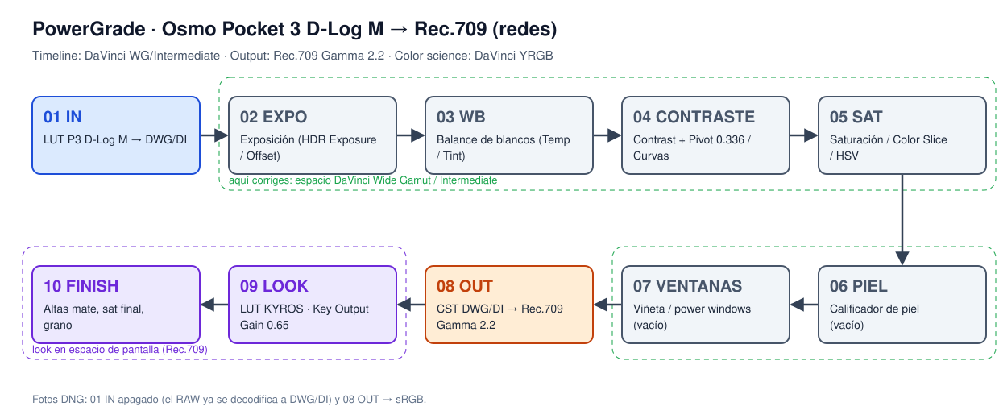
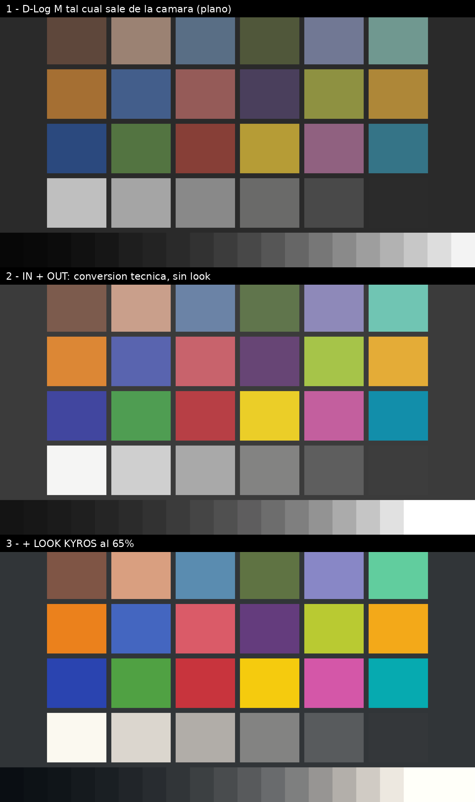

# Plantilla de color · DJI Osmo Pocket 3 → Rec.709 · DaVinci Resolve 21 (iPad)

Plantilla de nodos (PowerGrade) + LUT de entrada para pasar el **D-Log M** del Osmo Pocket 3 (y sus fotos **RAW DNG**) a **Rec.709 / sRGB** para redes, sin brincos de color, con nodos en medio para corregir y el look **KYROS** al final.



## Resumen rápido

1. Copia `LUTs/P3_DLogM_to_DWG-DI_65.cube` y tu `KYROS_SOFT.cube` a la carpeta de LUTs de Resolve en el iPad.
2. Configura el proyecto: **DaVinci YRGB**, timeline **DaVinci WG/Intermediate**, output **Rec.709 Gamma 2.2**.
3. Arma los 10 nodos de arriba en un clip y guárdalo como **PowerGrade**.
4. Para cada clip nuevo: aplicas el PowerGrade y solo mueves los nodos 02–07.
5. Para fotos DNG: mismo árbol, pero con el 01 apagado y el 08 a sRGB.

---

## Qué hay en esta carpeta

| Archivo | Para qué sirve |
|---|---|
| `LUTs/P3_DLogM_to_DWG-DI_65.cube` | **LUT de entrada.** Convierte D-Log M (Pocket 3) a DaVinci Wide Gamut / Intermediate. Es el que vas a usar. |
| `LUTs/P3_DLogM_to_DWG-DI_33.cube` | El mismo pero más ligero (33 puntos), por si el de 65 te da lata en el iPad. |
| `docs/node-tree.svg` | El diagrama del árbol de nodos. |
| `docs/P3_DLogM_test_chart.tif` | Carta de prueba codificada en D-Log M para checar que armaste bien la plantilla (ver sección 7). |
| `docs/preview_chart.png` | Cómo debe verse la carta: log plano → conversión → con KYROS al 65%. |
| `tools/` | Scripts en Python que generan todo lo anterior (por si quieres regenerar o cambiar algo). |

> Tus LUTs KYROS **no** están en el repo (son tuyos y quizá tienen licencia). Solo cópialos al iPad.

---

## Lo que encontré investigando (léelo, te ahorra errores)

- **El Pocket 3 no graba video RAW.** Graba **D-Log M 10-bit** (log plano), **HLG** o **Normal**. Lo "RAW" que tienes en video es el D-Log M. En **fotos** sí graba RAW real: **DNG** (y JPEG).
- **Resolve no trae D-Log M en el Color Space Transform.** El "DJI D-Log" que aparece en el CST es otro perfil (el de drones viejos tipo Mavic 2 Pro) y con D-Log M te deja la imagen **sobresaturada y con contraste de más**. Ese es el error de conversión más común en tutoriales.
- **DJI no publica la fórmula de D-Log M**, solo su LUT oficial "D-Log M to Rec.709" (que ya horneada va directo a Rec.709, sin espacio amplio para corregir).
- Por eso hice un **LUT de entrada a DaVinci Wide Gamut / Intermediate (DWG/DI)**: corriges en espacio amplio (como en cine) y al final el **CST nativo de Resolve** te lleva a Rec.709. La curva y la matriz vienen del ajuste por ingeniería inversa de Thatcher Freeman ([dwg-transforms](https://github.com/thatcherfreeman/dwg-transforms), "DJI Pocket 3 D-Log M to DWG"), hecho con clips del Pocket 3 y una ColorChecker. Ojo: **no es oficial de DJI**, así que puede diferir un pelo del LUT de DJI; para eso están los nodos 02–05.
- Comprobé el LUT contra la fórmula: el gris medio de D-Log M (código **0.40**) cae exacto en el gris medio de DI (**0.336**), los grises salen neutros, y una ColorChecker hace ida y vuelta con error de ~0.0002. El D-Log M del Pocket 3 aguanta unos **3.8 stops arriba del gris medio**.
- **Resolve 21 para iPad** ya tiene **página Photo** con soporte RAW, **incluyendo DNG**. Así que las fotos del Pocket 3 pasan por el mismo árbol de nodos.
- **DCTL en iPad** solo funciona con Resolve **Studio**. Por eso lo dejé en `.cube`, que jala en la versión gratis y en Studio.

### Lo que hace tu LUT KYROS (analizado numéricamente)

- **Ojo, los nombres están cruzados:** el archivo `KYROS.cube` por dentro se llama *"KYROS Sunday Kms v1 SOFT 65%"* y `KYROS_SOFT.cube` es el **completo** (*"KYROS Sunday Kms v1 (Rec709)"*).
- El SOFT es **exactamente** el completo mezclado al 65% con la imagen original (lo verifiqué, error < 0.000001). O sea: **usa el completo (`KYROS_SOFT.cube`) y controla la intensidad con Key Output Gain** (0.65 = SOFT idéntico).
- Es un LUT **creativo Rec.709 → Rec.709**, **no convierte log**. Si se lo pones directo al D-Log M, sale mal. Por eso va **después** del nodo OUT.
- Lo que hace:
  - **Sombras:** negro levantado con tinte teal/azul (el negro puro sale en R 0.00 / G 0.03 / B 0.05) → negros mate azulados.
  - **Altas:** cálidas, color crema (el blanco pierde ~4% de azul).
  - **Contraste:** curva S suave; los medios casi no se mueven (0.50 → 0.50).
  - **Saturación:** +28% en promedio, cian/azul empujados fuerte; el tono de piel no cambia de hue, solo sube su saturación.
  - **Hues:** verdes → hacia amarillo (unos −10°), azul cielo → hacia cian (−15°), amarillos → hacia naranja (−5°).
- En tus clips de referencia se ve igual: negros en ~4–5% con tinte teal, altas que topan en ~88–94% (mate) y color crema. Por eso el nodo 10 FINISH baja un poco las altas.



---

## 1. Instala los LUTs en el iPad

1. Pasa `P3_DLogM_to_DWG-DI_65.cube` y `KYROS_SOFT.cube` al iPad (AirDrop, iCloud, lo que sea).
2. App **Archivos** → **En mi iPad** → **DaVinci Resolve** → **LUT**. Crea una subcarpeta `Pocket3` y pégalos ahí.
3. En Resolve: **Ajustes del proyecto (engrane)** → **Color Management** → **Update Lists** para que los detecte.

> Si bajaste la versión gratis de la App Store y no ves esa carpeta, busca la carpeta LUT dentro de la carpeta de DaVinci Resolve que aparezca en Archivos; la ruta cambia un poco entre versiones.

## 2. Configura el proyecto (una vez por proyecto)

**Ajustes del proyecto → Color Management:**

| Opción | Valor |
|---|---|
| Color science | **DaVinci YRGB** (el manejo de color lo hacen los nodos) |
| Timeline color space | **DaVinci WG/Intermediate** |
| Output color space | **Rec.709 Gamma 2.2** (si no aparece junto, activa "usar espacio de color y gamma separados" y elige Rec.709 + Gamma 2.2) |

¿Por qué así?

- **Timeline en DWG/DI** hace que las herramientas "inteligentes" (paleta HDR, Exposure, Temp/Tint, Color Warper) sepan que la imagen está en DWG/DI y trabajen bien en los nodos 02–07.
- **Output Rec.709 Gamma 2.2** es la etiqueta que llevará el video exportado y con la que el iPad muestra el visor. **Tiene que coincidir con el nodo 08 OUT.** Gamma 2.2 es lo más parejo para redes (celulares y compus); 2.4 es para TV/cuarto oscuro.

> Truco: guarda este proyecto vacío como plantilla (o duplica siempre el mismo) y ya no configuras nada.

## 3. Arma el árbol de nodos (video D-Log M)

En el iPad, **mantener presionado = clic derecho**. Para etiquetar un nodo: mantén presionado el nodo → **Node Label**. Para agregar: mantén presionado → **Add Node → Add Serial**.

| # | Etiqueta | Qué le pones | Qué mueves ahí |
|---|---|---|---|
| 01 | **IN** | LUT `P3_DLogM_to_DWG-DI_65` (arrástralo del panel LUTs al nodo, o mantén presionado el nodo → LUT) | **Nada.** No lo toques nunca. |
| 02 | **EXPO** | — | Paleta **HDR** → rueda **Global** → **Exposure** (va en stops). También sirve **Offset** (en log, Offset = exposición). |
| 03 | **WB** | — | Paleta **HDR** → **Temp / Tint**. O el gotero de balance de blancos sobre algo blanco/gris. |
| 04 | **CONTRASTE** | — | Primaries → **Contrast** (empieza 1.10–1.25) con **Pivot 0.336** (el gris medio de DI; el default 0.435 es para Rec.709). Curvas si quieres más control. |
| 05 | **SAT** | — | **Sat** general, curvas **Hue vs Sat** o **Color Slice**. Aquí bajas cianes/azules si KYROS los empuja de más. |
| 06 | **PIEL** | vacío | Calificador HSL sobre la piel → para protegerla o calentarla. Vacío no hace nada. |
| 07 | **VENTANAS** | vacío | Viñeta (ventana circular invertida, baja un poco Gain/Offset) o ventanas para iluminar la cara. |
| 08 | **OUT** | Effects → **Color Space Transform** | Ver ajustes abajo. **No lo toques después.** |
| 09 | **LOOK** | LUT `KYROS_SOFT` (el completo) | Paleta **Key** → **Key Output Gain**: **0.65** = KYROS SOFT exacto; 1.0 = completo; 0.4 = más natural. |
| 10 | **FINISH** | — | Toques finales en Rec.709: baja el punto blanco de la curva a ~92–94% para las altas mate de tus referencias, un toque de sat, grano (Film Grain es de Studio). |

**Ajustes del CST en el nodo 08 OUT:**

| Campo | Valor |
|---|---|
| Input Color Space | DaVinci Wide Gamut |
| Input Gamma | DaVinci Intermediate |
| Output Color Space | Rec.709 |
| Output Gamma | **Gamma 2.2** (igual que el Output del proyecto) |
| Tone Mapping Method | **DaVinci** |
| Gamut Mapping Method | **Saturation Compression** |
| Lo demás | default (Forward/Inverse OOTF apagados) |

Reglas para no romper la conversión:

- **Todo lo que corrijas va entre 01 y 08.** Ahí la imagen está en DWG/DI y aguanta mucho más.
- **El look (KYROS) va después del 08**, porque es un LUT de Rec.709.
- Si un clip viene muy subexpuesto, corrígelo en **02 EXPO**, no subiendo Gain en el 10.
- Para comparar con tus referencias: importa tu clip de referencia, **Grab Still** y usa el **wipe / split screen** del visor.

## 4. Guárdalo como PowerGrade y reúsalo

**Crear el PowerGrade (una vez):**

1. Abre la **Galería** (Gallery) → en la lista de álbumes, mantén presionado → **Add PowerGrade Album**. Llámalo `Pocket 3`.
2. Con el clip ya armado con los 10 nodos, mantén presionado el visor → **Grab Still**.
3. Arrastra ese still al álbum PowerGrade `Pocket 3` y ponle nombre: `P3 VIDEO · D-Log M → 709 · KYROS`.
4. Haz lo mismo para las fotos (sección 5): `P3 FOTO · DNG → sRGB · KYROS`.

Los álbumes PowerGrade se ven en **todos los proyectos** de la misma base de datos.

**Aplicarlo a clips nuevos:**

1. En la página Color, selecciona todos los clips de D-Log M en la barra de miniaturas.
2. Mantén presionado el still del PowerGrade → **Apply Grade**.
3. Clip por clip, solo ajusta **02 EXPO, 03 WB, 04 CONTRASTE** (y 05–07 si hace falta). 01, 08 y 09 se quedan igual.

**Respaldo:** mantén presionado el still → **Export** → guarda el `.drx` (y el `.dpx` que sale junto) en Archivos/iCloud. Para importarlo en otro iPad o compu: en el álbum PowerGrade, mantén presionado → **Import** → elige el `.drx` (el `.dpx` tiene que estar en la misma carpeta).

> Opcional: si tu versión te deja "Save as Shared Node", conviértelos 01, 08 y 09 en nodos compartidos; así cambias la intensidad del look una vez y se actualiza en todos los clips.

## 5. Fotos RAW (DNG) del Pocket 3

La idea: que el RAW se decodifique **directo a DWG/DI**, así las fotos entran al mismo árbol que el video y tu look sale igual en fotos y videos.

1. **Ajustes del proyecto → Camera RAW** → perfil **CinemaDNG / DNG** → **Decode Using: Project**:
   - **Color Space: DaVinci Wide Gamut**
   - **Gamma: DaVinci Intermediate**
   - White Balance: As Shot · Highlight Recovery: activado
   (También lo puedes hacer foto por foto en la paleta **Camera RAW** con *Decode Using: Clip*.)
2. Aplica el PowerGrade `P3 FOTO`, que es el mismo árbol pero con:
   - **01 IN apagado** (mantén presionado → desactivar nodo). El RAW ya viene en DWG/DI; si le dejas el LUT, se convierte dos veces.
   - **08 OUT → Output Color Space: sRGB, Output Gamma: sRGB.**
3. Para exportar fotos (JPEG/HEIF/TIFF desde la página Photo), pon el **Output color space del proyecto en sRGB** para que el archivo salga etiquetado sRGB y el visor coincida. Si mezclas fotos y videos en el mismo proyecto, cámbialo antes de exportar cada cosa (o usa un proyecto aparte para fotos, que es más fácil).

**Si en Camera RAW no te aparecen DaVinci Wide Gamut / Intermediate:** elige **Color Space: Rec.2020** y **Gamma: Linear**, y en el nodo **01 IN** en vez del LUT pon un **CST** de *Rec.2020 / Linear* → *DaVinci Wide Gamut / DaVinci Intermediate* (tone mapping: None). Queda igual de correcto.

**Fotos JPEG** (no RAW): ya vienen en sRGB. Apaga **01 y 08** y usa solo 02–07 + LOOK.

## 6. Exporta para redes (Deliver)

- Formato: **MP4 / H.264** o **H.265** (H.265 10-bit si la app de destino lo acepta).
- Resolución: la de tu timeline (p. ej. 1080×1920 o 2160×3840 vertical).
- En **Advanced Settings**: **Color Space Tag** y **Gamma Tag** en *Same as Project* (Rec.709 / Gamma 2.2). **Data Levels: Auto (Video).**
- **Prueba de 30 segundos (hazla una vez):** exporta 5 s, pásalos al iPhone, míralos en Fotos y súbelos como historia privada. Si se ve igual que en el visor del iPad, listo. Si en iPhone/Instagram se ve lavado u oscuro comparado con el visor, cambia el **Output color space del proyecto a Rec.709-A** (hecho para cómo Apple muestra el video): el visor del iPad pasa a mostrarte lo mismo que verá un iPhone y reajustas a ojo. En Android se verá un pelo más contrastado; quédate con la opción que se vea bien en tu público principal.

## 7. Checa que la plantilla está bien armada

1. Importa `docs/P3_DLogM_test_chart.tif` (es una carta ColorChecker + escala de grises en stops, codificada como si fuera D-Log M del Pocket 3).
2. Aplica el PowerGrade con el nodo 09 LOOK apagado.
3. Debe verse como la **fila 2** de `docs/preview_chart.png`: grises **neutros** (sin tinte) en el waveform/parade, colores naturales y nada sobresaturado. Con el LOOK prendido al 65% debe parecerse a la **fila 3**.
4. Si se ve sobresaturada o con mucho contraste, revisa que el 01 tenga el LUT correcto y que el 08 diga **DaVinci Wide Gamut / DaVinci Intermediate** de entrada.

> La vista previa usa una conversión simplificada, así que las altas del CST real de Resolve van a verse un poco diferente; lo importante es que los grises salgan neutros y los colores no se disparen.

## Tips al grabar con el Pocket 3

- **Modo Pro → color D-Log M** (activa 10-bit). No uses 8-bit para log.
- **Balance de blancos manual**, no auto: así todos los clips llegan parejos y el nodo 03 casi no se toca.
- **Exposición:** no quemes altas (el D-Log M da ~3.8 stops sobre el gris medio). Un poquito sobreexpuesto (+0.3 a +0.7) limpia ruido en sombras; bájalo luego en 02 EXPO.
- **ISO bajo** siempre que puedas; en poca luz el ruido del log se nota. Si tienes Studio, pon un nodo de Noise Reduction justo después del 01.
- **Filtro ND** si quieres el shutter a 180° (1/50 en 24/25 fps, 1/60 en 30).

## Si grabaste en HLG o en Normal

- **HLG:** en el nodo **01 IN**, en vez del LUT pon un **CST**: Input *Rec.2020 / Rec.2100 HLG* → Output *DaVinci Wide Gamut / DaVinci Intermediate*, Tone Mapping *None*. Lo demás igual.
- **Normal:** ya viene en Rec.709. Apaga **01 y 08** y usa 02–07 + LOOK.

## Plan B: LUT oficial de DJI

Si prefieres el LUT oficial *"DJI OSMO Pocket 3 D-Log M to Rec.709"* ([DJI Download Center](https://www.dji.com/downloads/softwares/osmo-pocket-3-dlog-to-rec709)): ponlo en un nodo **después** de tus correcciones (que harías sobre el log) y **quita el 01 IN y el 08 OUT**. Orden: EXPO → WB → CONTRASTE → SAT → **LUT DJI** → LOOK KYROS → FINISH. Pierdes el espacio amplio para corregir y el tone mapping de Resolve, pero es 100% DJI. En ese caso pon el timeline y el output en Rec.709.

## Regenerar los archivos

```bash
cd tools
pip install -r requirements.txt
python3 generate_luts.py --size 65                      # LUT de entrada + validación
python3 generate_luts.py --size 33
python3 make_test_chart.py --look /ruta/a/KYROS_SOFT.cube --look-gain 0.65
python3 make_node_diagram.py
```

## Fuentes

- Curva y matriz D-Log M del Pocket 3: [thatcherfreeman/dwg-transforms](https://github.com/thatcherfreeman/dwg-transforms) (ingeniería inversa, no oficial).
- DaVinci Intermediate: whitepaper *DaVinci Resolve 17 Wide Gamut Intermediate* de Blackmagic.
- LUT oficial DJI Pocket 3: [DJI Download Center](https://www.dji.com/downloads/softwares/osmo-pocket-3-dlog-to-rec709).
- "DJI D-Log" del CST no sirve para D-Log M / no hay preset nativo: [Blackmagic Forum](https://forum.blackmagicdesign.com/viewtopic.php?f=33&t=186378), [DJI Forum](https://forum.dji.com/thread-297669-1-1.html), [MavicPilots](https://mavicpilots.com/threads/grading-d-log-m-in-resolve.141460/).
- Manejo de color por nodos (YRGB + CST, timeline DWG/DI, output Rec.709 Gamma 2.2): [Frame.io — cheat sheet](https://blog.frame.io/2023/12/04/color-management-cheat-sheet-davinci-resolve/), [Frame.io — RCM vs CST](https://blog.frame.io/2024/10/07/should-you-use-resolve-color-management-or-color-space-transforms-csts/).
- Resolve 21 iPad, página Photo y soporte DNG: [ProVideo Coalition](https://www.provideocoalition.com/davinci-resolve-21-released-in-record-time-including-the-ipad-version-with-the-new-photo-page/), [PetaPixel](https://petapixel.com/2026/04/16/the-davinci-resolve-21-photo-editing-tools-show-promise-but-are-imperfect/), [digitalfilms](https://digitalfilms.wordpress.com/2026/07/09/is-resolve-21-for-photographers/).
- LUTs y PowerGrades en iPad: [Epic Tutorials](https://epictutorials.com/blogs/articles/how-to-import-luts-into-davinci-resolve-on-ipad), [Filmmaking Elements](https://filmmakingelements.com/import-export-powergrade-in-davinci-resolve-ipad/).
- DCTL en iPad requiere Studio: [Blackmagic Forum](https://forum.blackmagicdesign.com/viewtopic.php?f=21&t=173272).
- Gamma / Rec.709-A al exportar: [Blackmagic Forum](https://forum.blackmagicdesign.com/viewtopic.php?f=21&t=114047), [Filmmaking Elements](https://filmmakingelements.com/davinci-resolve-export-color-different-gamma-shift-fix/).
- Fotos RAW DNG en el Pocket 3: [DJI — Specs](https://www.dji.com/osmo-pocket-3/specs).
